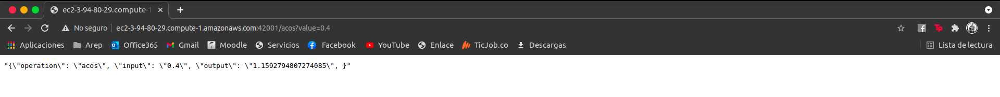
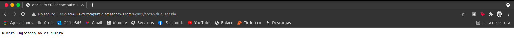
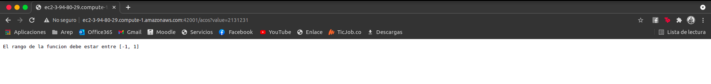

# Parcial Segundo Corte AREP

Parcial AREP Segundo Corte, Despliegue en EC2 y AWS lambda

## Información Del Proyecto

* La documentación del las clases y los métodos del proyecto se encuentran en el directorio adjunto /Javadoc/apidocs.

### Pre-Requisitos

Para correr este proyecto necesita los siguientes programas instalados, se adjuntan los links de como descargarlos:

> * [Como Instalar Java 8](https://www.oracle.com/co/java/technologies/javase/javase-jdk8-downloads.html)
> * [Como Instalar Apache Maven](http://maven.apache.org/download.html#Installation)
> * [Como Instalar Docker](https://docs.docker.com/engine/install/)

Adicionalmente se recomienda tener descargado los siguientes programas:

> * [Como Instalar Git](http://git-scm.com/book/en/v2/Getting-Started-Installing-Git)

### Video del funcionamiento

> * [Deployed to AWS](https://www.youtube.com/watch?v=EvoSen3HS9A)

### Calidad del código

[](https://www.codacy.com/gh/Candres1019/Parcial2-AREP/dashboard?utm_source=github.com&amp;utm_medium=referral&amp;utm_content=Candres1019/Parcial2-AREP&amp;utm_campaign=Badge_Grade)

### Integración Continua

[](https://app.circleci.com/pipelines/github/Candres1019/Parcial2-AREP)

### Imágenes del funcionamiento

> Aws EC2
> 
> Comportamiento con valores válidos:
> 
> 
> 
> Comportamiento con valores no numéricos:
> 
> 
> 
> Comportamiento con valores fuera del rango:
> 
> 

### Instalación en EC2

Nota: Inicialmente debe tener una máquina EC2 corriendo en AWS, para facilidad de la instalación
se tiene una imagen en DockerHub con el despliegue, haga click [aquí](https://hub.docker.com/repository/docker/candres1019/dockerparcialacos) para ir a la imagen

* Si va a usar la imagen del proyecto desplegada en DockerHub solamente debe ejecutar el siguiente comando:

  > Nota: Recuerde que el puerto que utilice debe estar previamente permitido en los grupos de seguridad de la instancia EC2"
  > ```
  > docker run -d -p 42001:6000 --name dcandrescalderonacos candres1019/dockerparcialacos
  > ```
  

1. Clonación del Proyecto:

    * Para **Clonar** el proyecto utilice el siguiente comando en la ventana de comandos:

   > ```
   > https://github.com/Candres1019/Parcial2-AREP.git
   > ```
      
2. En una ventana de comandos ejecuté el siguiente comando, dentro de la carpeta principal del proyecto:

   > ```
    > mvn package
    > ```
   

3. Para ejecutar la aplicación de manera local utilizamos en la ventana de comando los siguientes comandos:

   > ```
    > docker build --tag andrescalderonacos .
    > docker run -d -p 42001:6000 --name dcandrescalderonacos andrescalderonacos
    > ```


4. Para verificar que todo esté funcionando de manera correcta ejecutamos el siguiente comando:

   > ```
    > docker ps
    > ```
   
5. Para utilizar la API debe acceder al path asignado a la instancia de EC2 de la siguiente manera:

   > ```
    > http://{path}:42001/exp?value={numero}
    > ```


### Despliegue en Lambda

## Generación de Documentación 

Por defecto se creó la documentación JavaDoc y fue dejada en el directorio /Javadoc, si desea generar uno nuevo
utilice el siguiente comando, esta documentación quedará en el directorio /target/site/apidocs :

   > ```
   > mvn javadoc:javadoc
   > ```

## Ejecución de pruebas

En una ventana de comandos, utilice el siguiente comando:

   ```
    mvn test
   ```

## Construido Con

* [Java](https://www.java.com/es/) - Lenguaje de Programación.
* [JUnit](https://junit.org/junit5/) - Pruebas de Unidad.
* [Maven](https://maven.apache.org/) - Manejo de dependencias.
* [IntelliJ IDEA](https://www.jetbrains.com/es-es/idea/) - Entorno de Desarrollo.

## Authors

* **Andres Mateo Calderón Ortega** - [Candres1019](https://github.com/Candres1019)

# Licencia

Este proyecto está licenciado bajo la GNU v3.0 - ver el archivo [LICENSE](./LICENSE) para más detalles.
